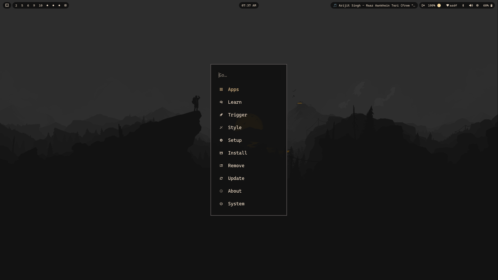

# ⛱ Aamis Theme for Omarchy

A thoughtfully crafted theme for [Omarchy](https://omarchy.org).
Near‑black canvas, creamy text, warm amber highlights, and a single red accent for clear, focused contrast.

> *"Aamis —  Code in the spotlight.."*
>
## Preview

| Lazygit |  BTOP   | Walker     |
|:---:|:---:|:---:|
|  |  |  |


---

## Color Palette


---

## Installation

```bash
omarchy-theme-install https://github.com/vyrx-dev/omarchy-aamis-theme.git
```

## Acknowledgments

This theme was created using [Aether](https://github.com/bjarneo/aether) by [@bjarneo](https://github.com/bjarneo).
