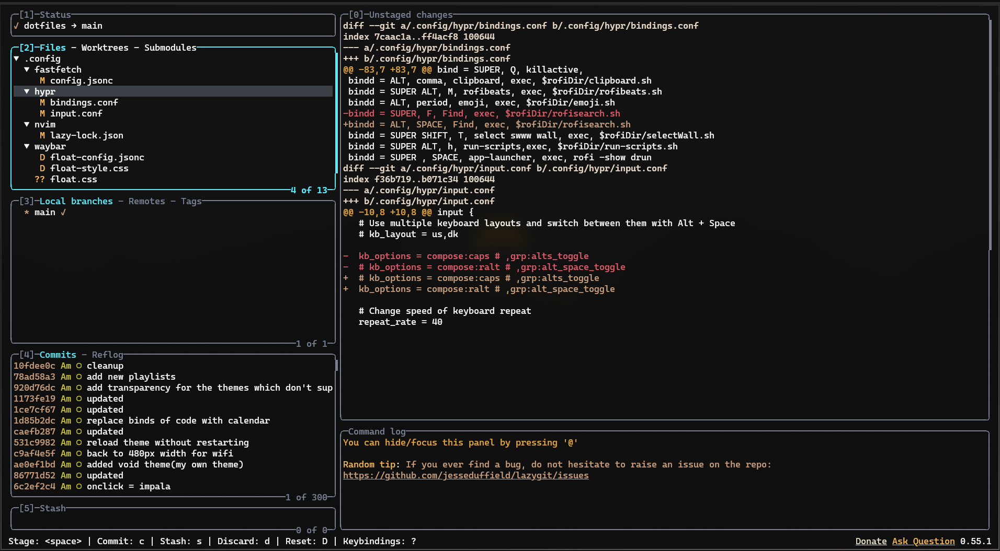
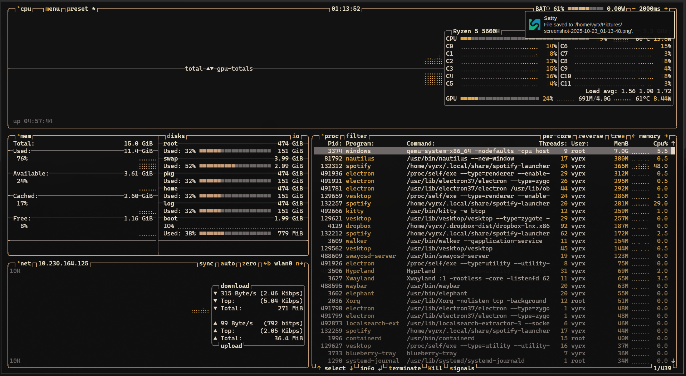
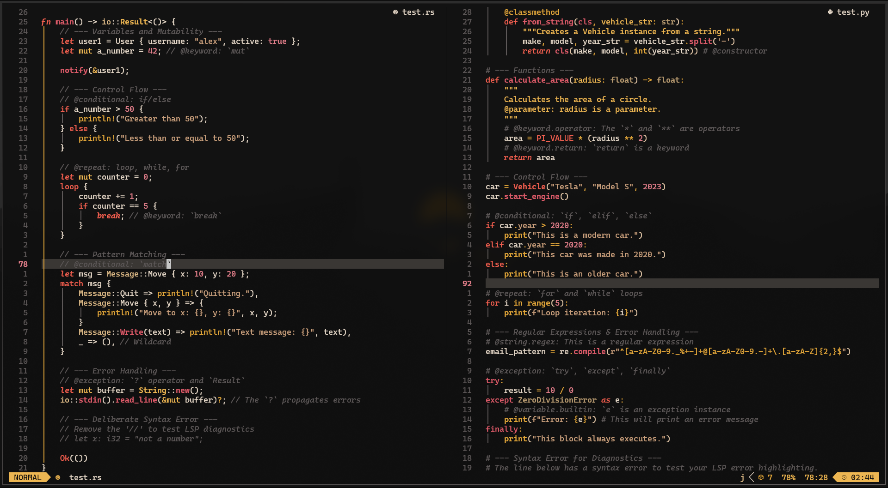
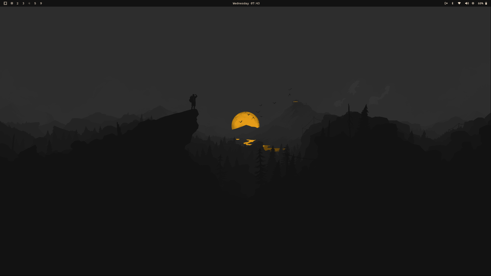
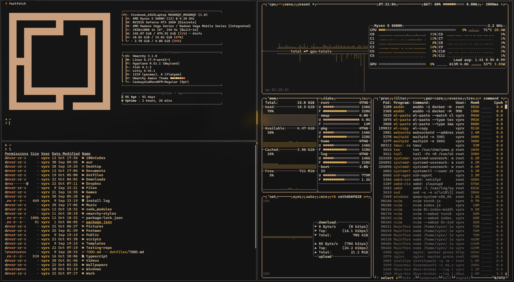
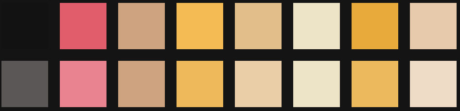

# ⛱ Aamis Theme for Omarchy — macOS Look

A thoughtfully crafted theme collection for [Omarchy](https://omarchy.org), bringing the quintessential **macOS Light Mode** and **Liquid Glass** aesthetic to your Linux setup.

> _"Aamis — The refined macOS look for Omarchy."_ — by [marexxxxxxx](https://github.com/marexxxxxxx)

## 🎨 The "Liquid Glass" Aesthetic

Aamis is designed to replicate the signature macOS feeling. Every detail is meticulously crafted to blend elegance with functionality:

- **Liquid Glass & Transparency:** Utilizing subtle glass-like blur effects and a ~0.90 opacity for terminals to create depth and a modern, airy feel.
- **Crisp & Clean:** Featuring crisp white backgrounds paired with classic Apple blue accents that highlight focus and clarity.
- **Soft Geometry:** Menus and UI elements feature ~20px rounded corners, softening the interface and matching the modern macOS design language.
- **Omarchy Philosophy First:** While we deeply embrace the macOS aesthetic, we have intentionally omitted the traditional macOS "traffic light" window controls (red, yellow, green buttons). This decision ensures the theme remains true to Omarchy's opinionated, clean, and distraction-free workflow.

---

## 📸 Preview

|            Lazygit             |           BTOP           |             Nvim             |
| :----------------------------: | :----------------------: | :--------------------------: |
|  |  |  |




---

## 🎨 Color Palette



---

## 🚀 Installation

Install the base theme easily via Omarchy's theme installer:

```bash
omarchy-theme-install https://github.com/marexxxxxxx/omarchy-mac.git
```

### Vesktop Theme

For Vesktop users, you can install this theme by copying the theme file to your Vesktop themes directory:

```bash
cd ~/.config/omarchy/themes/aamis/

cp vencord.theme.css ~/.config/vesktop/themes/Aamis.theme.css
```

### Vicinae Theme

To use Aamis in [Vicinae](https://vicinae.com) without touching existing themes:

```bash
# Create directories if they don't exist (safe if they already do)
mkdir -p ~/.local/share/vicinae/themes/icons

cp vicinae.toml ~/.local/share/vicinae/themes/aamis.toml
cp assets/icons/aamis-icon-transparent-bg.png \
  ~/.local/share/vicinae/themes/icons/aamis-theme-icon.png
```

### Typora Theme

In Typora, simply set the Theme in the *Themes* option after copying the CSS file:

```bash
cp aamis.css ~/.config/Typora/aamis.css
```

---

## 🙏 Acknowledgments

This theme was created using [Aether](https://github.com/bjarneo/aether) by [@bjarneo](https://github.com/bjarneo).

The Vicinae theme and logo were provided by [@lukapmoran](https://github.com/lukapmoran).

The Typora theme was contributed by [@pymmog](https://github.com/pymmog).

The VS Code theme was contributed by [@fedesapuppo](https://github.com/fedesapuppo).

## Waybar Theme

This theme provides a completely customized macOS-style Waybar setup featuring floating "liquid glass" modules.
Since the `omarchy-theme-install` command only automatically applies the styling (`waybar.css`), you need to manually copy the module layout configuration (`waybar.jsonc`) to get the full macOS experience.

To set up the layout:

```bash
# Backup existing config (optional)
mv ~/.config/waybar/config.jsonc ~/.config/waybar/config.jsonc.bak 2>/dev/null

# Copy the macOS layout from the theme directory
cp ~/.config/omarchy/themes/aamis/waybar.jsonc ~/.config/waybar/config.jsonc

# Reload waybar
killall -SIGUSR2 waybar