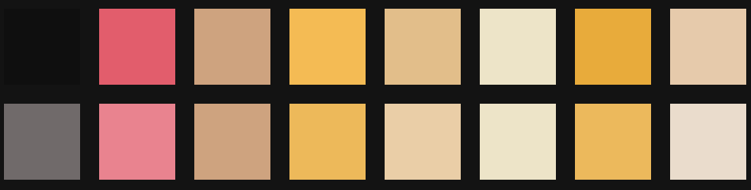

# ⛱ Aamis Theme for Omarchy

A thoughtfully crafted theme for [Omarchy](https://omarchy.org).
Near‑black canvas, creamy text, warm amber highlights, and a single red accent for clear, focused contrast.

> _"Aamis — Code in the spotlight.."_

## Preview

|            Lazygit             |           BTOP           |             Nvim             |
| :----------------------------: | :----------------------: | :--------------------------: |
|  |  |  |


---

## Color Palette



---

## Installation

```bash
omarchy-theme-install https://github.com/vyrx-dev/omarchy-aamis-theme.git
```

## Vesktop-Theme

For Vesktop users, you can install this theme by copying the theme file to your Vesktop themes directory:

```bash
cd ~/.config/omarchy/themes/aamis/

cp vencord.theme.css ~/.config/vesktop/themes/Aamis.theme.css
```

## Vicinae Theme

To use Aamis in [Vicinae](https://vicinae.com) without touching existing themes:

```bash
# Create directories if they don't exist (safe if they already do)
mkdir -p ~/.local/share/vicinae/themes/icons

cp vicinae.toml ~/.local/share/vicinae/themes/aamis.toml
cp assets/icons/aamis-icon-transparent-bg.png \
  ~/.local/share/vicinae/themes/icons/aamis-theme-icon.png
```

This copies the transparent icon `assets/icons/aamis-icon-transparent-bg.png` as `aamis-theme-icon.png` in Vicinae's themes icons folder.

## Acknowledgments

This theme was created using [Aether](https://github.com/bjarneo/aether) by [@bjarneo](https://github.com/bjarneo).

The Vicinae theme and logo were provided by [@lukapmoran](https://github.com/lukapmoran).
